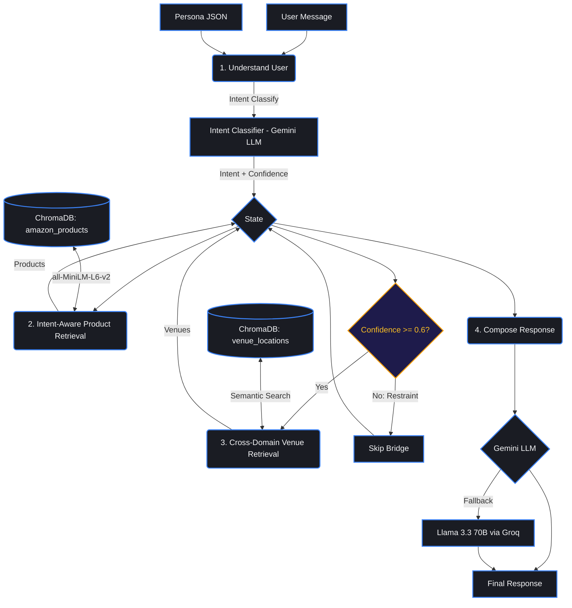

# OmniNaija

**Intent-Based Cross-Domain Recommender for Emerging Markets**

> Most recommenders use static lookup tables. OmniNaija ships **intent reasoning** that dynamically bridges domains — Amazon products to local Nigerian venues — using an **Intent Graph** to understand *why* users buy, not just *what*.

**DSN × BCT LLM Agent Challenge Hackathon**

---

## Quick Test (Try It Now)

> Replace `BASE_URL` with the live deployment URL or `http://localhost:8000` if running locally.

### Task A — Simulate a Review

```bash
curl -X POST "$BASE_URL/simulate" \
  -H "Content-Type: application/json" \
  -d '{
    "persona_description": {
      "name": "Tobi",
      "location": "Yaba, Lagos",
      "traits": ["budget-conscious", "developer"]
    },
    "product_id": "Electronics:B07Y11LT52"
  }'
```

**Returns:** a star rating (1-5) and a persona-matched review in natural Nigerian English.

### Task B — Get a Recommendation

```bash
curl -X POST "$BASE_URL/recommend" \
  -H "Content-Type: application/json" \
  -d '{
    "persona_description": "A remote worker in Lagos",
    "message": "Nepa cut light again, what should I buy to stay online?",
    "session_id": "test-001"
  }'
```

**Returns:** product recommendations (UPS, power banks) + cross-domain venue suggestions (cafes with generators) + full intent debug info.

### Health Check

```bash
curl $BASE_URL/
# → {"message": "OmniNaija API is running"}
```

---

## API Endpoints

| Method | Endpoint | Task | Description |
|--------|----------|------|-------------|
| `GET` | `/` | — | Health check |
| `POST` | `/simulate` | **Task A** | Persona-based review & rating simulation |
| `POST` | `/recommend` | **Task B** | Intent-aware recommendation with cross-domain bridging |
| `POST` | `/graph_simulate` | — | Raw graph execution (debug) |
| `GET` | `/docs` | — | Interactive Swagger API docs |

### `POST /simulate` — Task A: User Modeling

Simulates what a specific persona would rate and write about a product.

**Request:**
```json
{
  "persona_description": {
    "name": "Tobi",
    "occupation": "freelance developer",
    "location": "Yaba, Lagos",
    "traits": ["budget-conscious", "values backup power"]
  },
  "product_id": "Electronics:B07Y11LT52"
}
```

**Response:**
```json
{
  "rating": 5,
  "review": "As a dev, I really needed something reliable that wouldn't break the bank. This charger is quite solid..."
}
```

### `POST /recommend` — Task B: Personalised Recommendation

Multi-turn conversational endpoint. Classifies user intent, retrieves relevant products, and triggers a **Cross-Domain Bridge** to suggest local Nigerian venues when confidence is high.

**Request:**
```json
{
  "persona_description": "A remote worker in Lagos",
  "message": "Nepa cut light again, what should I buy to stay online?",
  "session_id": "optional-session-id"
}
```

**Response:**
```json
{
  "session_id": "optional-session-id",
  "recommendation": "For your situation, the CyberPower CP685AVRLCD UPS System is your best bet...",
  "intent": {
    "intent": "home_power_resilience",
    "confidence": 0.95,
    "bridge_category": "power_backup"
  },
  "debug": {
    "bridged": true,
    "products": ["Electronics:B079Z981R2", "Electronics:B07SYW3XL1"],
    "locations": ["digital_nomad_cafe_hub_6.5242"]
  },
  "history": [...]
}
```

**Key fields:**
- `intent.intent` — classified user need (e.g. `home_power_resilience`, `remote_work_setup`, `fitness_journey`)
- `intent.confidence` — how certain the system is (0-1)
- `debug.bridged` — `true` if cross-domain venue bridge was triggered (requires confidence >= 0.6)
- `debug.locations` — suggested local venues from the Yelp-style database

---

## How It Works



### Key Innovations

1. **Intent-Aware Query Rewriting** — When a user says "Nepa cut light", the word "light" would normally retrieve LED book lights. Our system classifies the intent first (`home_power_resilience`), then rewrites the search query to target UPS systems, power banks, and inverters.

2. **Recency-Anchored Retrieval** — When a persona has purchase history, the vector search anchors on the last 1-2 product titles for highly relevant results.

3. **Cross-Domain Bridge** — Connects Amazon products to Nigerian venue recommendations (cafes with generators, coworking spaces with WiFi) when intent confidence >= 0.6. Refuses to bridge when signal is weak (66.7% restraint rate).

4. **Endlessly Expandable Architecture** — While currently implemented for local Nigerian venues (Yelp-style), the Intent Graph is domain-agnostic. It can be easily expanded to bridge e-commerce with flight bookings, event ticketing, or food delivery APIs based on user intent.

5. **Nigerian Persona Modeling** — Custom profiles modeling local context: Pidgin vocabulary, power grid reliance, Owambe logistics, budget constraints.

---

## Evaluation Results

| Metric | Score | What It Measures |
|--------|-------|-----------------|
| **BERTScore F1** | `0.749` | Semantic quality of simulated reviews (Task A) |
| **Category-Match@10** | `58.0%` | Retrieval accuracy across 6k product categories (Task B) |
| **Cross-Domain Accuracy** | `90.0%` | Correct Amazon → Yelp venue mapping (Task B) |
| **Bridge Precision** | `100.0%` | Zero false venue recommendations |
| **Bridge Restraint** | `66.7%` | Correctly refuses bridging when confidence is low |

Run evaluations yourself:
```bash
python evaluation/evaluate_v2.py          # Full evaluation
python evaluation/evaluate_v2.py --quick  # Quick 10-case check
```

---

## Setup & Run

### Option 1: Docker (Recommended)

```bash
git clone https://github.com/Olaiwonismail/OmniNaija.git && cd OmniNaija

# Configure API keys
cp .env.example .env
# Edit .env → add GEMINI_API_KEY (required)

# Build data and launch
python -m venv .venv
source .venv/bin/activate        # Windows: .venv\Scripts\activate
pip install -r requirements.txt
python scripts/bootstrap.py      # Builds ChromaDB vector databases (~1 min)

# Start services
docker compose up --build -d
```

- **API:** http://localhost:8000
- **API Docs:** http://localhost:8000/docs
- **UI Dashboard:** http://localhost:8501

### Option 2: Run Directly (No Docker)

```bash
git clone https://github.com/Olaiwonismail/OmniNaija.git && cd OmniNaija
cp .env.example .env              # Add your API keys
python -m venv .venv
source .venv/bin/activate
pip install -r requirements.txt
python scripts/bootstrap.py       # Build vector databases
uvicorn main:app --host 0.0.0.0 --port 8000
```

### Environment Variables

| Variable | Required | Description |
|----------|----------|-------------|
| `GEMINI_API_KEY` | Yes | Google Gemini API key |
| `GROQ_API_KEY` | No | Groq API key (fallback LLM) |
| `HF_TOKEN` | No | HuggingFace token (dataset access) |
| `DEMO_MODE` | No | Set `true` for cached responses |

---

## Tech Stack

| Component | Technology |
|-----------|-----------|
| **Orchestration** | LangGraph-style Intent Graph |
| **Primary LLM** | Google Gemini |
| **Fallback LLM** | Llama 3.3 70B (Groq) |
| **Vector DB** | ChromaDB (persistent) |
| **Embeddings** | `all-MiniLM-L6-v2` (local) |
| **API** | FastAPI + Uvicorn |
| **UI** | Streamlit |
| **Deployment** | Docker Compose |

---

## Project Structure

```
OmniNaija/
├── agent/                    # Intent classification & graph flow
│   ├── graph.py              # State-machine retrieval with intent-aware query rewriting
│   └── intent.py             # LLM-powered intent classifier
├── api/Dockerfile            # API container
├── ui/
│   ├── streamlit_app.py      # Frontend dashboard
│   └── Dockerfile            # UI container
├── evaluation/               # Offline evaluation suite
│   ├── evaluate_v2.py        # BERTScore, hit-rates, text quality
│   └── evaluate_rmse.py      # Rating RMSE evaluator
├── scripts/                  # Setup & data ingestion
│   ├── bootstrap.py          # One-click setup orchestrator
│   ├── amazon_ingest.py      # HuggingFace dataset streaming
│   ├── build_chroma.py       # Product vector DB builder
│   └── build_venue_chroma.py # Venue vector DB builder
├── personas/                 # Nigerian persona profiles (JSON)
├── prompts/                  # LLM prompt templates
├── config.py                 # Global configuration
├── llm.py                    # LLM provider with fallback
├── main.py                   # FastAPI endpoints + CORS
├── docker-compose.yml        # Multi-service orchestration
└── requirements.txt          # Python dependencies
```

---

## Author

**Olaiwon Ismail** — DSN × BCT LLM Agent Challenge Hackathon

See `solution_paper.md` for the full architectural deep dive.
