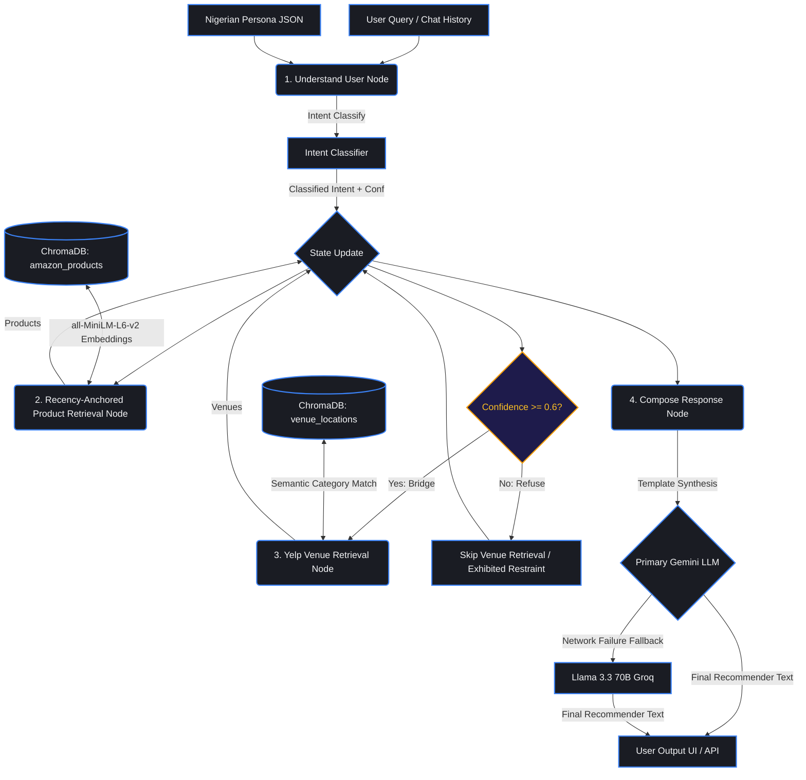

# OmniNaija Lite 🇳🇬
### Intent-Based Cross-Domain Recommender for Emerging Markets

> Most recommenders use static lookup tables. OmniNaija ships **intent reasoning** that dynamically bridges domains (Amazon products ↔ Yelp venues) using an **Intent Graph** to understand *why* users buy, not just *what*. Built for the **DSN × BCT LLM Agent Challenge**.


---

## 💡 The Core Innovation
Traditional engines are blind to emerging market context (e.g., power outages). OmniNaija solves this:
- **Nigerian Personas:** Custom profiles modeling local context (Pidgin vocabulary, grid reliance, Owambe logistics).
- **Recency-Anchored Retrieval:** Anchors product vector search to the user's latest 1-2 purchases to ensure highly relevant recommendations.
- **Dynamic Cross-Domain Bridge:** Connects Amazon products to Yelp venues (e.g., recommends a backup power bank and a Yaba coworking cafe with generators).
- **Strict Restraint:** Refuses to bridge domains when intent confidence is low (66.7% restraint).

---

## 📐 System Architecture & Layout

### Reasoning Flow (Intent Graph)



### Directory Layout

```text
OmniNaija/
├── agent/                  # Core AI & Reasoning Orchestration (Intent & Graph Flow)
│   ├── graph.py            # LangGraph-inspired state-machine retrieval execution
│   └── intent.py           # Intent extraction & confidence classifier
├── api/                    # FastAPI Backend API Server (Dockerised)
│   └── Dockerfile          
├── ui/                     # Streamlit Frontend Web App (Dockerised)
│   ├── streamlit_app.py    
│   └── Dockerfile          
├── evaluation/             # Offline Quantitative Evaluation Suite & Metric JSONs
│   ├── evaluate_v2.py      # Main off-line evaluator (BERTScore, hit-rates, text quality)
│   ├── evaluate_rmse.py    # Standalone Task A simulated rating RMSE evaluator
│   ├── evaluate.py         # Original benchmark script
│   └── *.json              # Pre-calculated benchmark evaluation results
├── scripts/                # Utility, Database Ingestion, and Setup Scripts
│   ├── bootstrap.py        # 1-click clean PC setup orchestrator (Windows safe)
│   ├── amazon_ingest.py    # HF dataset reviews-first streaming ingest
│   ├── build_chroma.py     # Product vector database builders
│   ├── build_venue_chroma.py# Yelp venue vector database builders
│   ├── generate_venues.py  # Synthetic Nigerian venues dataset compiler
│   └── sanity_check.py     # LLM Gateway connection checker
├── personas/               # Research-anchored Nigerian context profiles (JSON)
├── prompts/                # Raw plain-text prompt templates
├── config.py               # Global system configuration and API loaders
├── llm.py                  # LLM provider runner with thread-safe failure fallbacks
└── main.py                 # Core API endpoints setup
```

---

## 📊 Quantitative Results
Offline evaluation against held-out datasets yields the following verified metrics:

| Metric | Score | Significance |
|--------|-------|--------------|
| **Task A: BERTScore F1** | `0.7490` | High semantic fidelity in persona review simulation. |
| **Task B: Category-Match@10** | `58.0%` | Accurately predicts purchase category out of 6k options. |
| **Task B: Cross-Domain Accuracy** | `90.0%` | Correctly maps Yelp venues to Amazon intent. |
| **Task B: Bridge Precision** | `100.0%` | Zero irrelevant venue bridge hallucinations. |
| **Task B: Bridge Restraint** | `66.7%` | High confidence refusal when signal is weak. |

---

## 🛠 Tech Stack & Models
*   **Orchestration:** LangGraph (Reasoning Flow)
*   **Primary LLM:** Gemini (Google API)
*   **Fallback LLM:** `llama-3.3-70b-versatile` (Groq API)
*   **Vector DB:** ChromaDB (Local, Persistent)
*   **Embeddings:** `sentence-transformers/all-MiniLM-L6-v2` (Local)
*   **Evaluation:** `distilbert-base-uncased` (Offline Metrics)

---

## 🏃‍♂️ Zero-Friction Setup

Initialize databases, stream processed subsets, and launch the system in a clean environment:

```bash
# 1. Clone & enter repository
git clone https://github.com/Olaiwonismail/OmniNaija.git && cd OmniNaija

# 2. Add API keys
cp .env.example .env  # fill in env variables

# 3. Create and activate a virtual environment
python -m venv .venv
source .venv/bin/activate  # On Windows, use: .venv\Scripts\activate

# 4. Bootstrap data & build ChromaDB (takes < 1 min)
pip install -r requirements.txt
python scripts/bootstrap.py

# 5. Launch UI & API in Docker
docker-compose up --build
```
*   **Frontend App:** [http://localhost:8501](http://localhost:8501)
*   **FastAPI API Docs:** [http://localhost:8000/docs](http://localhost:8000/docs)

---

## 🔌 API Endpoints (Task Deliverables)

FastAPI serves the containerized REST API endpoints mapped exactly to the hackathon deliverables:

### 1. Task A: User Modeling (Review & Rating Simulation)
*   **Endpoint:** `POST /simulate`
*   **Description:** Takes a user persona description and a product ID as input. Simulates a star rating and written review matching that persona's historical context, biases, and dialect (Nigerian Pidgin/English).
*   **Request Payload:**
    ```json
    {
      "persona_description": {
        "name": "Tobi",
        "occupation": "freelance developer",
        "location": "Yaba, Lagos",
        "traits": ["budget-conscious", "values backup power"]
      },
      "product_id": "Electronics:B07Y11LT52",
      "demo_mode": false
    }
    ```
*   **Response Payload:**
    ```json
    {
      "rating": 5,
      "review": "Omo, this charger na life saver o! With the constant NEPA issues here for Yaba, it keeps my phone and router powered all day..."
    }
    ```

### 2. Task B: Personalised Recommendation (Intent Graph & Cross-Domain Bridge)
*   **Endpoint:** `POST /recommend`
*   **Description:** Multi-turn conversational endpoint that takes a user persona and message history, retrieves context-relevant Amazon products, and triggers the Cross-Domain Bridge to recommend localized Yelp venues (e.g., generator-backed cafes/gyms) when a high-confidence intent is classified.
*   **Request Payload:**
    ```json
    {
      "persona_description": "A freelance developer in Lagos seeking laptop gear",
      "message": "My power is out again. What should I buy next to stay online?",
      "session_id": "optional-session-123",
      "demo_mode": false
    }
    ```
*   **Response Payload:**
    ```json
    {
      "session_id": "optional-session-123",
      "recommendation": "1. Recommended Product: Anker Power Bank... 2. Cross-Domain Spot: We highly recommend checking out Yaba Hub Cafe, which has strong generator backup and WiFi...",
      "intent": {
        "intent": "remote_work_setup",
        "confidence": 0.92,
        "bridge_category": "cafes_with_power"
      },
      "debug": {
        "bridged": true,
        "locations": ["yaba_hub_cafe_6.452"]
      }
    }
    ```

---

## 🧪 Testing & Offline Evaluation

Run the evaluation suite in-process (no server startup required):

```bash
# Task B + Task A Text (Hits, NDCG, ROUGE, BERTScore)
python evaluation/evaluate_v2.py

# Task A Ratings (RMSE Evaluation)
python evaluation/evaluate_v2.py --review-sim

# Quick 10-Case Verification
python evaluation/evaluate_v2.py --quick
```

---

## 📝 Details
*   **Author:** Olaiwon Ismail 
*   **Event:** DSN × BCT LLM Agent Challenge Hackathon
*   **Deep Dive:** See `solution_paper.md` for architectural design and intent mappings.
